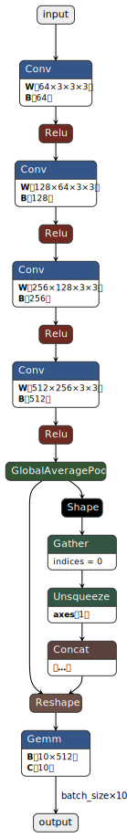

# Example inference code of TensorRT(C++)

This is example inference code of TensorRT.  
I checked on the following environment.

- reComputer J4012(Jetson Orin NX 16GB)
- JetPack 5.1.2
- TensorRT 8.5.2

And, I used `onnxruntime` to compare the result between ONNX Runtime and TensorRT.

- onnxruntime-gpu 1.15.1
  - <https://elinux.org/Jetson_Zoo#ONNX_Runtime>

## Preparation

### create ONNX model

I created `model/model_bn.onnx`. This model was generated using the following steps.  
<https://github.com/NVIDIA-AI-IOT/jetson_dla_tutorial>



### Build TensorRT Engine

Please build engine by TensorRT.

```shell
trtexec --verbose --profilingVerbosity=detailed --buildOnly --memPoolSize=workspace:8192MiB --onnx=model/model_bn.onnx --saveEngine=model/model_bn.onnx.engine > model_bn.onnx.engine.build.log
```

If you use DLA(Deep Learning Accelerator), please add `--useDLACore` option.

```shell
trtexec --verbose --profilingVerbosity=detailed --buildOnly --memPoolSize=workspace:8192MiB --onnx=model/model_bn.onnx --saveEngine=model/model_bn.onnx.engine --useDLACore=0 --allowGPUFallback > model_bn.onnx.engine.build.log
```

## Inference

I created `main.cpp` to infer using TensorRT Engine.

### include NvInfer.h

```cpp
#include <NvInfer.h>
```

### deserialize TensorRT Engine

```cpp
nvinfer1::ICudaEngine* engine = runtime->deserializeCudaEngine((const void*)engine_data.get(), engine_size);
```

### create context

```cpp
nvinfer1::IExecutionContext* context = engine->createExecutionContext();
```

### inference

```cpp
std::vector<void*> bindings = {d_input, d_output};
bool status = context->executeV2(bindings.data());
```

## Build

```shell
cmake -Bbuild -DCMAKE_BUILD_TYPE=Release
cp -r model build
cd build
make
```

## Result

### ONNX Runtime(CPUExecutionProvider)

```shell
$ python3 ort_infer.py 
[[-0.00331396 -0.025011   -0.00538983  0.01257806  0.02580202  0.00101936
  -0.02642873  0.02599718  0.01044547  0.00243419]]
```

### TensorRT(without DLA)

```shell
$ ./trt-infer-example-cpp 
[TRT] Loaded engine size: 6 MiB
[TRT] Deserialization required 4773 microseconds.
[TRT] [MemUsageChange] TensorRT-managed allocation in engine deserialization: CPU +0, GPU +5, now: CPU 0, GPU 5 (MiB)
[TRT] Total per-runner device persistent memory is 0
[TRT] Total per-runner host persistent memory is 19872
[TRT] Allocated activation device memory of size 98816
[TRT] [MemUsageChange] TensorRT-managed allocation in IExecutionContext creation: CPU +0, GPU +1, now: CPU 0, GPU 6 (MiB)
-0.00331459 -0.025011 -0.00539156 0.0125793 0.0258018 0.00101785 -0.0264283 0.0259966 0.0104437 0.00243466 
```

### TensorRT(with DLA)

```shell
$ ./trt-infer-example-cpp 
[TRT] Loaded engine size: 3 MiB
[TRT] Deserialization required 2401 microseconds.
[TRT] [MemUsageChange] TensorRT-managed allocation in engine deserialization: CPU +3, GPU +0, now: CPU 3, GPU 0 (MiB)
[TRT] Total per-runner device persistent memory is 0
[TRT] Total per-runner host persistent memory is 1472
[TRT] Allocated activation device memory of size 10752
[TRT] [MemUsageChange] TensorRT-managed allocation in IExecutionContext creation: CPU +0, GPU +0, now: CPU 3, GPU 0 (MiB)
-0.00331497 -0.0250092 -0.00539017 0.0125809 0.0257874 0.00102234 -0.0264282 0.026001 0.0104446 0.00243759 
```

## Reference

- <https://docs.nvidia.com/deeplearning/tensorrt/developer-guide/index.html>
- <https://docs.nvidia.com/deeplearning/tensorrt/api/c_api/index.html>
- <https://github.com/dusty-nv/jetson-inference/blob/master/c/tensorNet.cpp>
- <https://github.com/MrLaki5/TensorRT-onnx-dockerized-inference/blob/main/src/trt_engine.cpp>
